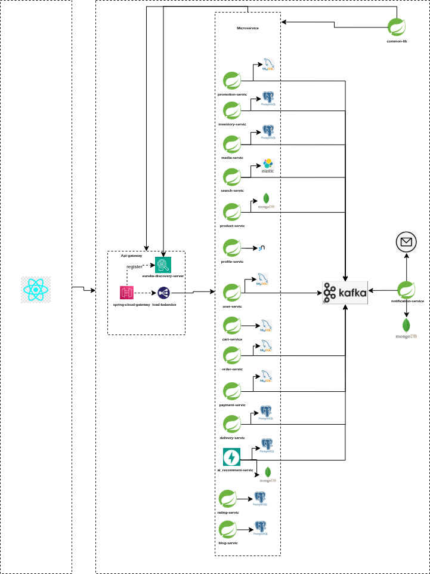

# Ecommerce Microservice BackEnd
Backend system provides restfull API for web or mobile. 

## Introduction
This Java/Kotlin backend is designed to handle the server-side logic and data processing for my application.


## System Architecture
<p align="center">
  
</p>

---

## Prerequisites
Before you begin, ensure you have met the following requirement:
- Java Development Kit (`JDK 17`) or higher installed.
- Build tool (e.g., `Maven` or `Gradle`) installed.
- Database system (`MySQL`, `PostgreSQL`, `MongoDB`, etc.) set up and configured.
- **Elasticsearch** – used for full-text search, product indexing, and fast query capabilities.
- Liquibase Migration Database `MySQL`.
- Reactive Programming with WebFlux Reactor Spring Boot.
- Hibernate, JPA, WebFlux.
- Docker build.
- Send message and receiver using kafka server.
- Postman Testing and Client.

## Feature
- Using `Microservice` as a high level architecture.

## Getting Started
Follow these steps to set up and run the backend.

### 1.Clone the repository:
```bash
git clone https://github.com/okits02/Graduation-Project.git
```
### 2. Navigate to the project directory:
```bash
cd Graduation-Project
```
### 3. Build the project:
```bash
mvn clean install
```

### 4. Build the docker compose:
```bash
docker-compose up
```

### 5. Configuration the database:
- Update application.properties or application.yml with your database connection details.

### 6. Run the Application:
Build all services and the common library:

### Step 1: Build the Shared Library

Before running any microservice, you **must build and install the `common-lib` module first**.  
This module contains **shared packages, utilities, DTOs, and configurations** that are used across multiple services.

```bash
cd common-lib
mvn clean install
```

*Note: This is critical ensuring `common-lib` is available for other services.*

It is recommended to run services in the following order:

1.  **Discovery Service** (Eureka)
    - Path: `discovery-service`
    - Command: `mvn spring-boot:run`
2.  **API Gateway**
    - Path: `api-gateway`
    - Command: `mvn spring-boot:run`
3.  **Core Services** (Start these as needed or all together)
    - `user-service`
    - `profile-service`
    - `product-service`
    - `order-service`
    - `inventory-service`
    - `notification-service`
    - `media-service`
    - `search-service`
    - `payment-service`
    - `rating-service`
    - `promotion-service`
    - `cart-service`
    - `analys-service`
    - `delivery-service`

## Access Points
- **Eureka Dashboard**: [http://localhost:8761](http://localhost:8761) (Default port)
- **API Gateway**: [http://localhost:8888](http://localhost:8888) (Default port, check `application.yml` if different)

## Technologies Used

- `Java`: The primary programming language.
- `Spring Boot`: Framework for building Java-based enterprise applications.
- `Maven/Gradle`: Build tools for managing dependencies and building the project.
- `Database`: Choose and specify the database system used (e.g., MySQL, PostgreSQL).
- `Other Dependencies`: List any additional dependencies or libraries used.

## API Documentation

Each microservice exposes its OpenAPI documentation via the API Gateway.

Base format:

http://localhost:8888/api/v1/{application-name}/v3/api-docs

Example:

http://localhost:8888/api/v1/product-service/v3/api-docs